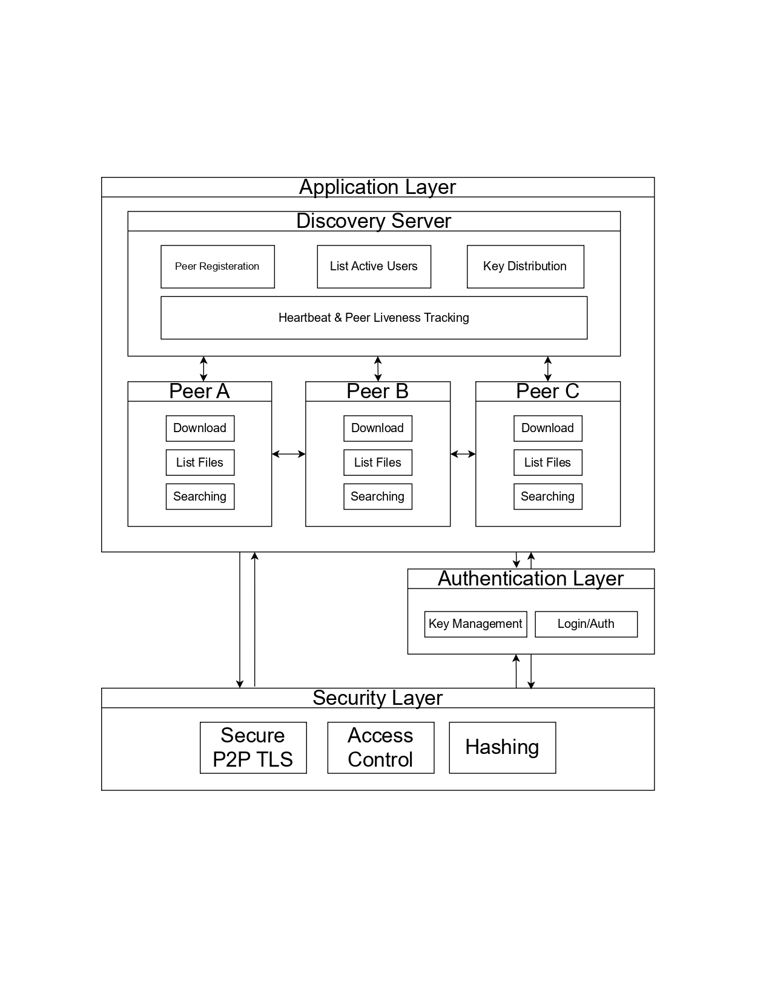

---

# Decentralized P2P File Sharing Platform

## Overview

**CipherShare** is a decentralized P2P file sharing platform that ensures secure and resilient file exchange between peers. The system was designed with modularity and scalability in mind, enabling easy integration of future features such as authentication, encryption, and GUI-based interaction.

This version of the project implements a decentralized peer discovery mechanism. Peers attempt to register with a centralized discovery server (by default on port 6000). In the decentralized mode, each node maintains its own neighbor list and uses controlled flooding (broadcast messages with TTL and unique identifiers) to search for files and peer information.

## System Architecture
Below is a high-level overview of **CipherShare's** modular architecture, showcasing the interaction between layers (Application, Authentication, Security) and peer nodes:

  
*Figure 1: Decentralized P2P architecture with discovery servers, peer registration, and secure file exchange.*

---

## 🔍 Diagram Breakdown

### 1. Application Layer

The top layer that manages all user-facing operations and peer interactions.

**Discovery Server** acts as a bootstrap point:
- **Peer Registration**: Nodes register here when they first come online.
- **List Active Users**: Tracks online peers and helps newcomers connect.
- **Key Distribution**: Shares public keys securely for encrypted communication.
- **Heartbeat & Liveness Tracking**: Continuously monitors peer availability.

**Peer Nodes (A, B, C)**:
Each peer can perform the following operations:
- **Search**: Discover files or peers.
- **List Files**: Display local files available for sharing.
- **Download**: Fetch files directly from another peer.

---

### 2. Authentication Layer

Ensures only verified peers can interact with the network.

Handles:
- **Login/Auth**: Validates identity of peers.
- **Key Management**: Manages cryptographic keys for secure sessions.

---

### 3. Security Layer

Foundation for all secure communications:
- **Secure P2P TLS**: End-to-end encrypted channels between peers.
- **Access Control**: Ensures only authorized peers can request/download files.
- **Hashing**: Used for integrity checks (e.g., verifying that downloaded files haven’t been tampered with).

---

## 🔁 Communication Flow

- Peers first attempt to register with the **Discovery Server**. If unavailable, they fall back on decentralized discovery.
- Once connected, they can **search for files**, **list local and remote files**, and **download files** directly from other peers.
- All communication is **secured using encryption** and validated using the **authentication layer**.

---

## ⚙️ Modular Design Advantage

Layers are decoupled, enabling easy upgrades. For example:
- A **GUI interface** can replace CLI at the Application Layer.
- **OAuth2** can replace simple login in the Authentication Layer.
- **Post-quantum encryption** can replace traditional TLS at the Security Layer.


## Project Specifications

- **Project Title:**  
  CipherShare: A Secure Distributed File Sharing Platform with User-Centric Credential Management

- **Key Features (Phase 1 + Decentralized Discovery):**
  - **Basic P2P File Sharing:**  
    Peers can list, download, and share files (stored in a local folder).
  - **Centralized Discovery Fallback:**  
    On startup, a node attempts to register with a discovery server (default IP: 127.0.0.1, port: 6000).
  - **Decentralized Peer Discovery:**  
    - **Broadcast Search:** Searches for a file across the network by flooding broadcast messages with a TTL.
    - **Discover Neighbors:** Nodes can query their neighbors (using a new `DISCOVER` command) to receive additional neighbor lists and merge them into their own.
  - **Modular and Extensible Design:**  
    The project abstracts core functionalities like P2P networking, broadcast discovery, and file I/O, making it easy to integrate new features (e.g., authentication, encryption, or GUI modules) in future phases.

- **Technology Stack:**
  - **Programming Language:** Python 3
  - **Networking:** TCP sockets (Python’s `socket` module)
  - **Concurrency:** Threads (Python’s `threading` module)
  - **File I/O:** Local file system operations for file sharing
  - **Utilities:** UUID for message identification; basic locking to ensure thread safety

## Installation & Setup

### Prerequisites

- Python 3.7 or higher
- Git (optional, if you plan to clone the repository)

### Steps to Initialize and Run in a Virtual Environment

1. **Clone the Repository (if using Git):**

   ```bash
   git clone https://github.com/silentunicorn249/CipherShare.git
   cd ciphershare
   ```

2. **Create a Python Virtual Environment:**

   On Linux/macOS:
   ```bash
   python3 -m venv venv
   source venv/bin/activate
   ```

   On Windows:
   ```bash
   python -m venv venv
   venv\Scripts\activate
   ```


3. **Project Directory Structure:**

   ```
   ciphershare/
   ├── shared_files/              # Directory where shared files are stored
   ├── discovery_server.py        # Centralized discovery server module (optional)
   ├── node.py                # Main P2P node code with decentralized discovery
   ├── README.md                  # This file
   └── requirements.txt           # Optional dependencies file
   ```

4. **Running the Discovery Server (Optional):**

   If you wish to use the discovery server, run it in a separate terminal:
   ```bash
   python discovery_server.py
   ```

5. **Running a P2P Node:**

   To start a node, run the main node script:
   ```bash
   python node.py --port 5000
   ```

   The node will attempt to connect to the discovery server (by default at 127.0.0.1:6000). If the server is unreachable, it will prompt you to enter an alternate node address.

6. **Using the CLI:**

   Once the node is running, you’ll see the CLI prompt. Available commands include:
   - **list_local** – List local shared files.
   - **list_peer \<ip> \<port>** – Get the file list from a specific peer.
   - **add_neighbor \<ip> \<port>** – Manually add a neighbor.
   - **discover** – Query known neighbors for their neighbor lists.
   - **bcast_search \<filename>** – Broadcast a search for a file.
   - **download \<ip> \<port> \<filename>** – Download a file from a peer.
   - **exit** – Exit the application.

## Future Enhancements

- **Authentication & Secure Credential Management:**  
  In upcoming phases, we plan to integrate robust user authentication mechanisms (e.g., secure password hashing, challenge-response protocols) to ensure only authorized users access the network.

- **File Encryption & Integrity Verification:**  
  Subsequent versions will encrypt files prior to transmission and verify file integrity using cryptographic hash functions (e.g., SHA-256).

- **GUI Integration:**  
  While the current interface is CLI-based, the modular design allows for a future GUI to be built on top of the core P2P network libraries.

- **Advanced Peer Discovery Protocols:**  
  Consider integrating more efficient decentralized protocols (e.g., a Distributed Hash Table or gossip-based protocols) for scaling the network.

## Support

For any questions or issues, please open an issue on the repository.

---

This README provides a comprehensive guide to the project, ensuring that users and developers can easily set up, run, and understand the platform's current capabilities and planned enhancements.
